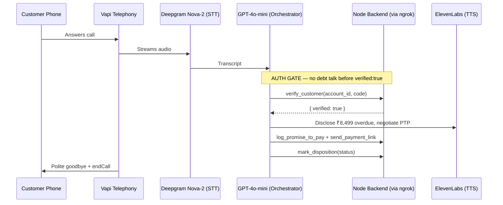

# 🎙️ Maya — Voice AI Collections Agent for Kapture Finance

An automated, compliance-first **outbound voice collections agent** built on Vapi.ai. Maya authenticates customers securely, negotiates Promise-to-Pay (PTP) commitments, dispatches payment links, and logs dispositions — with **zero debt disclosure before identity verification**.

**Stack:** Vapi · OpenAI GPT-4o-mini · Deepgram Nova-2 · ElevenLabs · Node.js/Express · ngrok

---

## 🎯 Overview

Maya executes the full collections call lifecycle:

1. **Greeting & Identity Hook** — confirms she's speaking to the target customer.
2. **Authentication Gate** — verifies last-4 PAN / birth year via `verify_customer` tool. *No debt details are ever disclosed before this gate.*
3. **Negotiation** — PTP capture, already-paid handling, hardship escalation, disputes, DNC opt-out.
4. **Wrap-up** — payment link dispatch + `mark_disposition` logging + graceful hang-up.

---

## 🏗️ Architecture



### Latency Budget (target < 1.2s round-trip)

| Hop | Tech | Budget |
| :--- | :--- | :--- |
| Telephony ingest | Vapi/SIP | ~100ms |
| Speech-to-Text | Deepgram Nova-2 | ~200ms |
| LLM first byte | GPT-4o-mini (temp 0.1) | ~350ms |
| Text-to-Speech | ElevenLabs | ~250ms |
| Network out | Vapi audio | ~150ms |

---

## 📁 Repository Structure

```
kapture-collections-voicebot/
├── README.md
├── .gitignore
├── docs/                  # HLD document & diagrams
├── vapi/
│   ├── system_prompt.txt  # Production state-machine prompt
│   └── tool_definitions.json
├── mock-server/
│   ├── server.js          # Webhook handler + dashboard API
│   ├── package.json
│   └── .env.example
└── tests/
    └── test_cases.json    # Evaluation matrix
```

---

## 🚀 Quick Start

### Prerequisites
Node.js v18+, ngrok, a Vapi account (free tier).

### 1. Run the backend
```bash
cd mock-server
npm install
npm start            # runs on http://localhost:3000
```

### 2. Expose it publicly
```bash
ngrok http 3000      # copy the https URL
```

### 3. Configure Vapi Assistant
| Setting | Value |
| :--- | :--- |
| Transcriber | Deepgram `nova-2` |
| Model | OpenAI `gpt-4o-mini`, temperature `0.1` |
| Voice | ElevenLabs (professional female) |
| First Message | *"Hello, this is Maya calling from Kapture Finance. Am I speaking with Mr. Rahul Sharma?"* |
| System Prompt | paste `vapi/system_prompt.txt` |
| Tools | import `vapi/tool_definitions.json`; Server URL = `<ngrok-url>/webhook` |

### 4. Demo verification codes
The mock backend accepts: **`1234`** (PAN last-4) or **`1995` / `85`** (birth year).

### Backend API
| Endpoint | Purpose |
| :--- | :--- |
| `POST /webhook` | Receives Vapi tool calls |
| `POST /api/start-call` | Triggers outbound call via Vapi REST (`/call/phone`) |
| `GET /api/events` | Live tool-activity feed + metrics (for dashboard) |

---

## 🛡️ Compliance & Guardrails

- **Zero-debt disclosure pre-auth** — words like *loan/EMI/overdue/amount* are forbidden until `verify_customer` returns `verified: true`.
- **Third-party protection** — wrong-person calls end without revealing account existence.
- **Instant DNC** — opt-out requests logged via `mark_disposition(DO_NOT_CALL)` and call terminated.
- **RBI Fair Practices** — calling window 08:00–19:00, respectful tone, no threats, no unauthorized waivers.
- **Secrets hygiene** — API keys live only in `.env` (git-ignored); frontend never sees them.

---

## 🧠 Design Decisions

| Decision | Why |
| :--- | :--- |
| `gpt-4o-mini` over `gpt-4o` | ~2× faster TTFB keeps round-trip < 1.2s; strict instruction-following at temp 0.1 |
| Server-side webhook pattern | Private keys stay on the backend; Vapi tool calls verified server-side |
| State-machine prompt | Deterministic flow; compliance gate enforced by tool result, not LLM goodwill |
| In-memory mock store | Demo-grade; swap for Postgres in production |

---

## 🐞 Debugging Log (real issues faced & fixed)

| Issue | Root Cause | Fix |
| :--- | :--- | :--- |
| `git add` failed: *"mock-server/ does not have a commit checked out"* | Accidental nested `.git` inside `mock-server/` | Removed nested `.git`, re-staged |
| LF/CRLF warnings on Windows | Line-ending normalization | Harmless; ignored |
| Free Vapi number can't dial out | New accounts are inbound-only (anti-fraud/telecom KYC) | Documented production path: import Twilio (verified provider) |
| ngrok URL changes on restart | Free-tier ephemeral domains | Re-update tool Server URLs, or reserve a static domain |
| LLM occasionally hinted at debt pre-auth (temp 0.7) | High creativity | Lowered temperature to 0.1 + hardened prompt rules |

---

## 🔭 Future Enhancements

- **Production telephony:** Twilio KYC account, A2P 10DLC / India DLT registration, NCPR/DND scrubbing, caller-ID transparency, number warm-up.
- **Batch dialer:** cron job iterating delinquent accounts → `POST /call/phone` with concurrency caps & answering-machine detection.
- **Persistence:** Postgres for dispositions/PTPs; Redis for call state.
- **Bilingual mode:** Hindi/Hinglish via Deepgram multi-language + language-switch prompt rules.
- **React mission-control dashboard** (local prototype built; excluded from this repo) — one-click outbound dialing + live tool-activity feed.

---

## 📊 Observability Metrics

- **Containment Rate** — calls resolved without human escalation
- **PTP Rate** — authenticated calls ending in a logged promise-to-pay
- **First Call Resolution** — valid dispositions logged per call
- **Auth Success Rate** — verifications passed on first attempt

---

*Built as a production-design demo for Kapture Finance. See `docs/` for the full High-Level Design document.*